# Kong's Market

<div id="header" align="center">

  

</div>

## :pencil: Descriptions:

This is a marketplace web app created using Django and BootStrap. Users can create, sell, and buy products. Buyers have the ability to view and cancel orders, while sellers can cancel orders or update order statuses. Both products and orders have full CRUD functionalities. PostgreSQL is used as the database to store all information. The project is fully deployed on Heroku.

## :computer: Getting Started:

You can access the app by clicking the link [here](https://kong-market-5f9a6bf5752f.herokuapp.com/).

## :bust_in_silhouette: Attributions:

For this project, I used the Fake Store API to create fake products. The api can be found using this [link](https://fakestoreapi.com/).

For the initial Postgres database seeding, I borrowed the code from this stackoverflow [post](https://stackoverflow.com/questions/51577441/how-to-seed-django-project-insert-a-bunch-of-data-into-the-project-for-initi). To initialize the database with fake products run in the project's root directory:
```
python3 manage.py seed --mode=refresh
```

## :blue_book: Wireframes and ERD:

These are some page blueprints used to guide the development process.

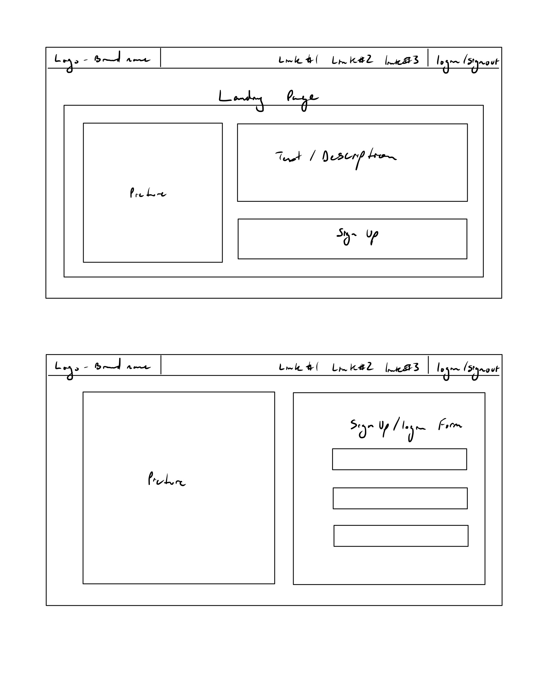
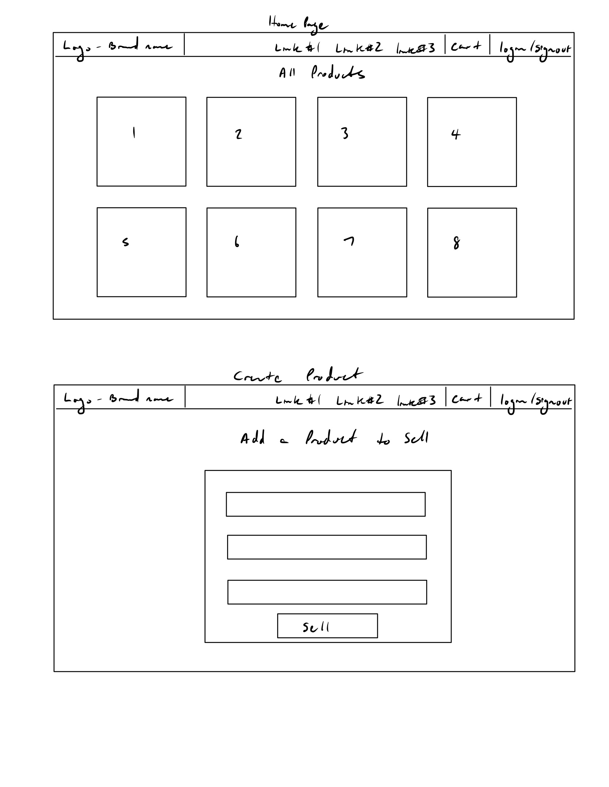
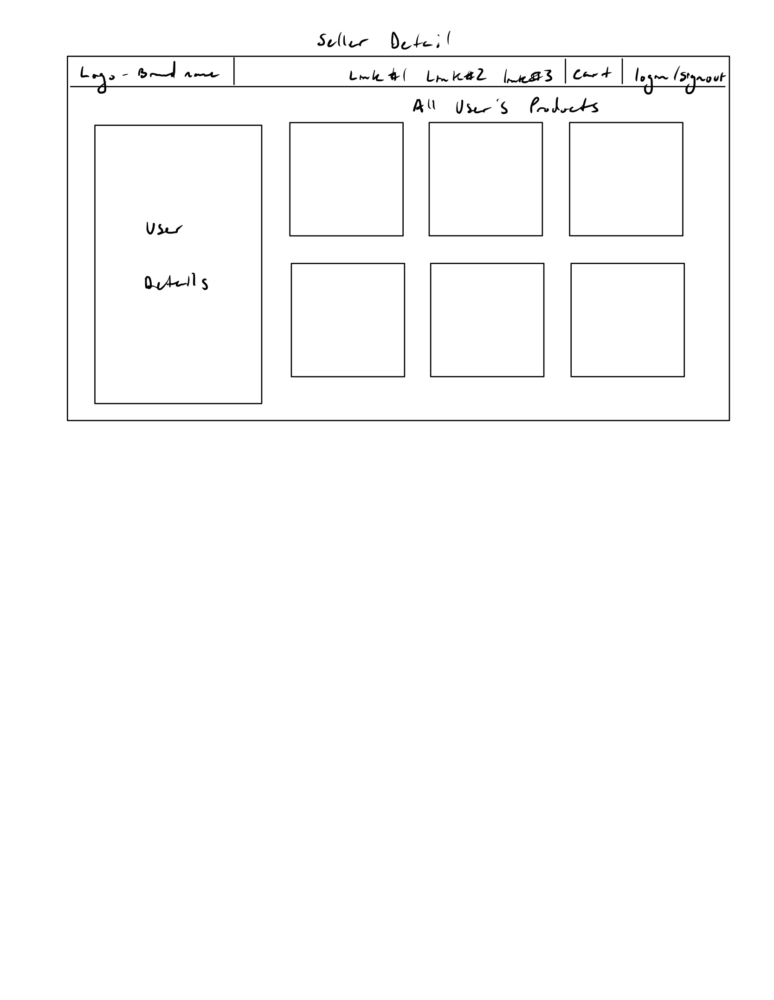
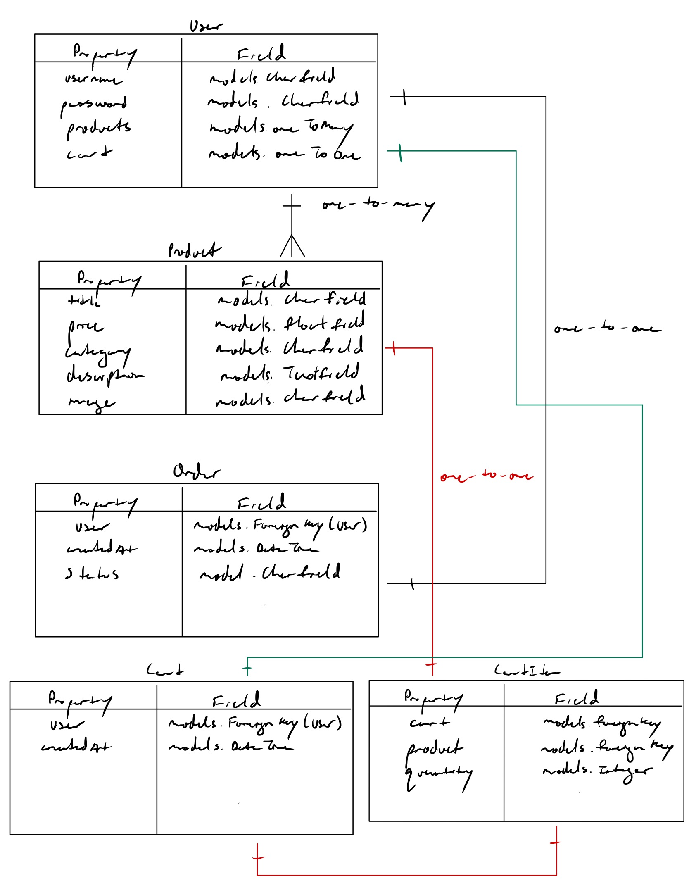
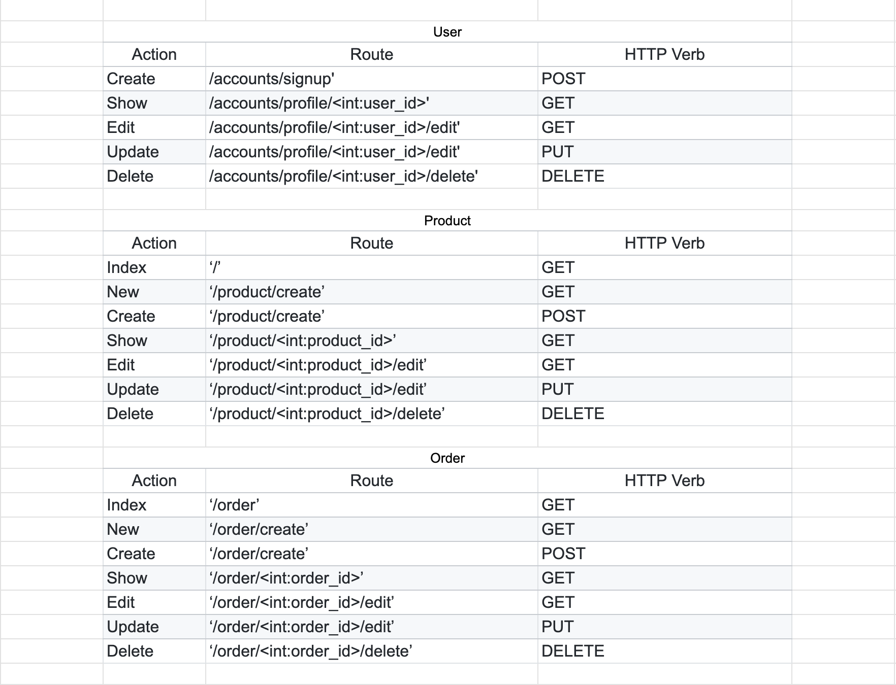


## :camera_flash: Kong's Market Images:

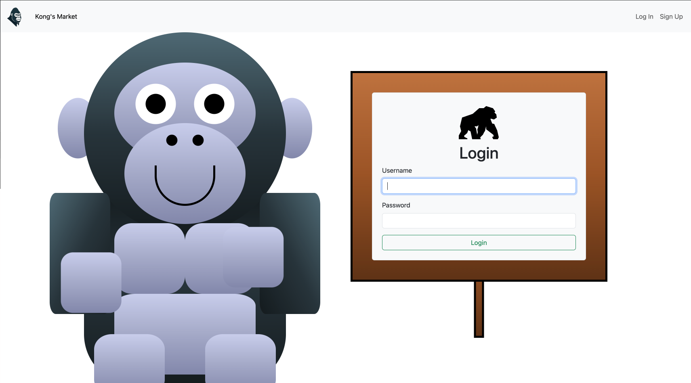
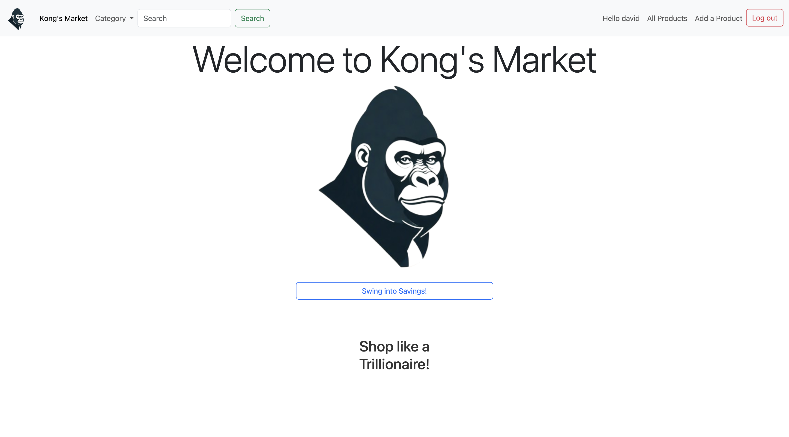
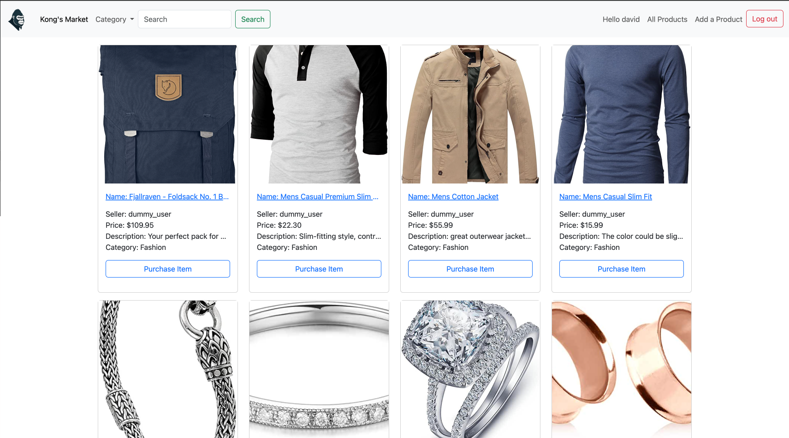
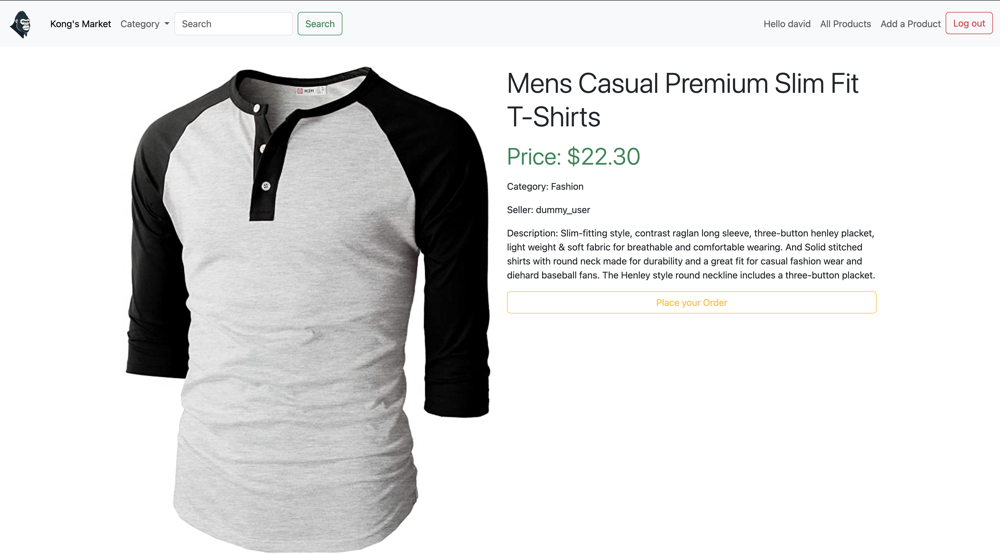
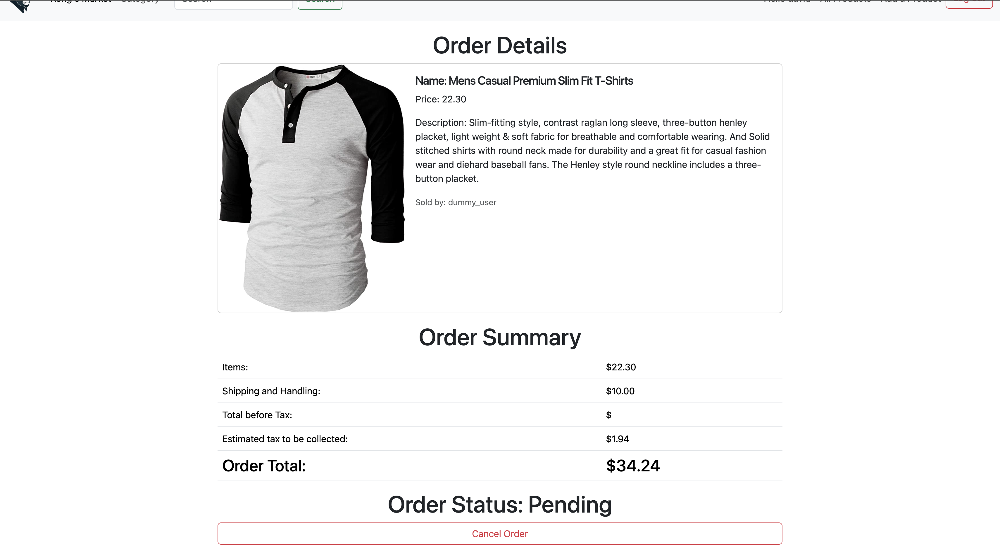
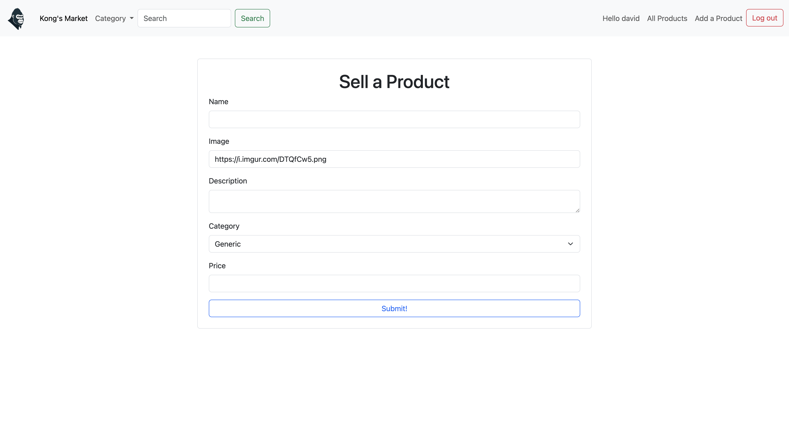
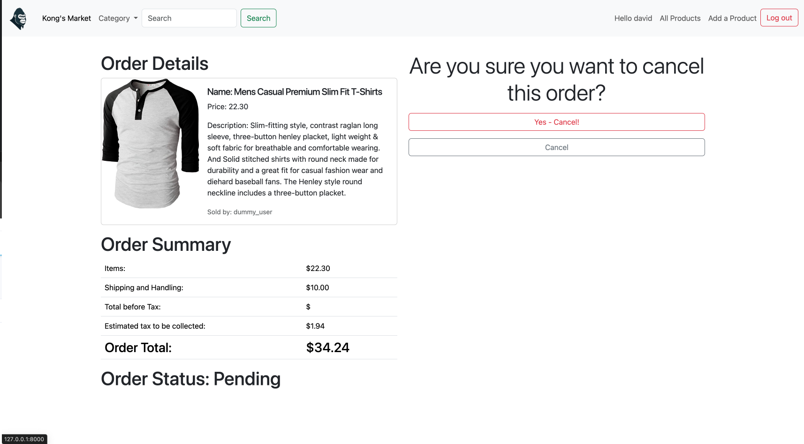
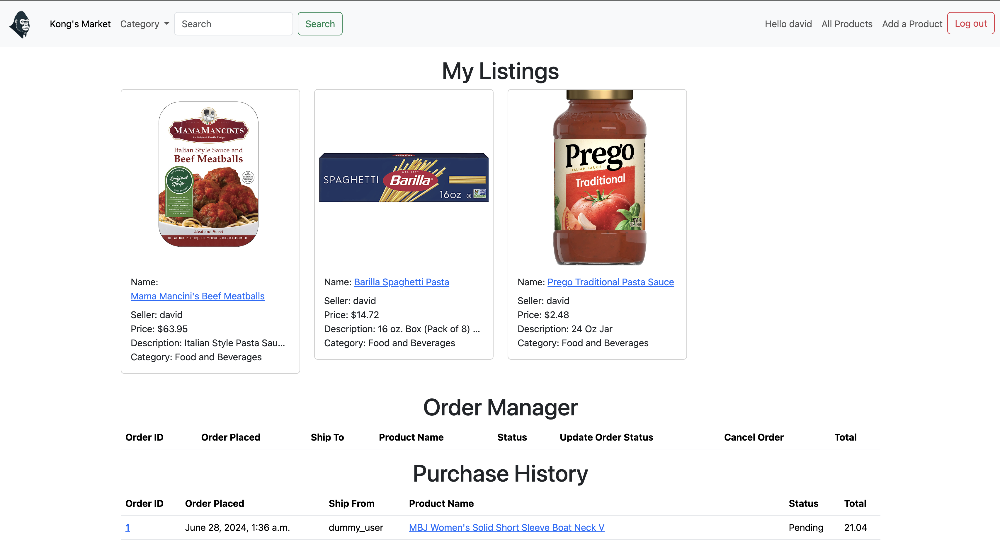


## :computer: Technologies Used:


## :satellite: Next Steps:

Here are some potential improvements to the project:

- Functionality to export order history as a PDF
- Send order confirmation email
- Add Cart to store products
- Compatibility with mobile devices
